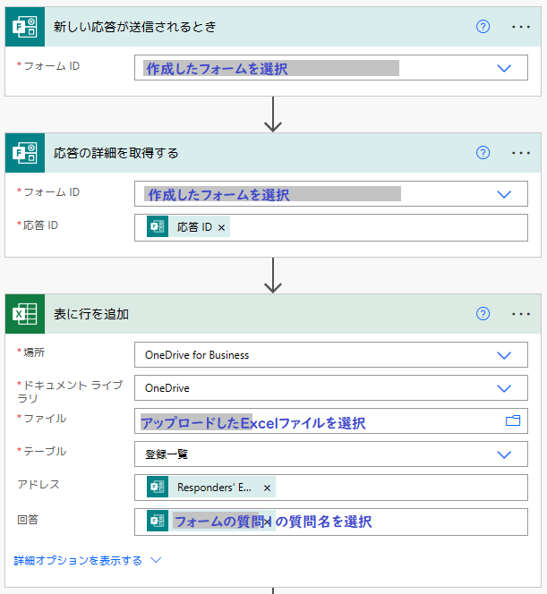
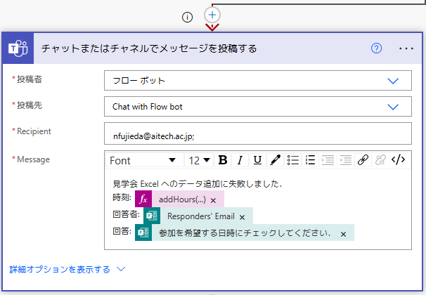
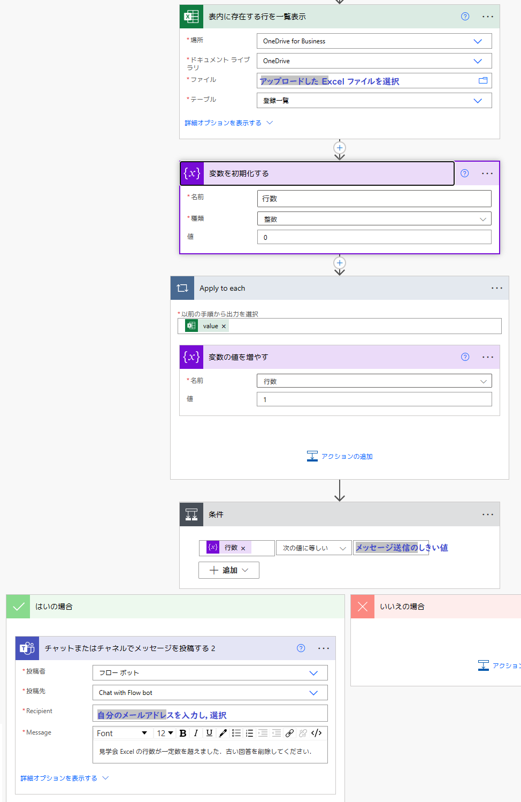

# リアルタイム回答状況更新可能なアンケートの作成
2023-01-31 (Uploaded on 2023-03-29) Naoki FUJIEDA, AIT

## 概要
このリポジトリは，愛知工業大学が契約する Microsoft 365（AICoT）のサービスを使い，
リアルタイムに回答状況が更新できるアンケートを作成する方法と，そのための Excel
テンプレートを設置しています．

基本的には愛知工業大学の学内向けに最適化していますが，若干の改変を加えれば，
Microsoft 365 を採用している他の機関でも利用できるかもしれません．

## 使用するツール
Microsoft 365 で，以下のサービスが契約範囲内にあることを前提とします．
- Forms
- Excel（基本的にオンライン版）
- Power Automate
- Teams（エラー通知する場合のみ）

## 動作するしくみ
1. Forms で学生がアンケートの回答を送信
2. 1をトリガーとして Power Automate のフローが起動して，回答を Excel のテーブル
   に記録
3. Excel 側でテーブルから各学生の最新回答を選別し，回答項目ごとにその回答をした
   学生の学籍番号を先着順で表示
4. 必要に応じ，Power Automate でエラーが発生したり，回答が一定数に達したりした
   場合には，その旨を Teams のチャットで通知

## テンプレートの使用手順
### Forms でのアンケートの作成
まずは，Forms で新規にアンケートを作成します．

1. Forms で新規フォームを作成して，選択肢形式の質問を1つ作成
2. 作成した質問に対して，回答項目を列挙し，複数回答はなし，回答は必須に設定
3. フォームの設定（「…」ボタンから）を開き，「自分の所属組織内のユーザーのみが
   回答可能」「名前を記録」にチェック
4. 「回答を収集」ボタンを押して，表示された回答ページへの URL を記録

### Excel テンプレートの編集と公開
次に，回答状況を閲覧してもらうための Excel ファイルを編集・公開します．
以下の4まではオフラインで作業することを想定しています．
ただ，最初にアップロードして，全てオンライン版の Excel で作業しても構いません．

1. 付属の Excel テンプレートを開く
2. 一覧シートの A 列（回答項目）の2行目以降に，Forms での回答項目を順に記載
   -  一覧シートの行が足りない場合は，シート中間に行を挿入して，他の行のB列以降に
      書かれた式を，挿入した行にコピー
3. 項目ごとに表示される人数を増やす場合は，シート中間に列を挿入して，他の列の
   全ての行に書かれた式を，挿入した列にコピー
   - デフォルトでは，項目あたりの表示する人数は10人
   - 人数を減らす場合は，単にシート中間の列を削除
4. 項目ごとに緑色・黄色で表示される人数を変更するには，データシートの1行目の
  「緑色表示は6番まで」「黄色表示は8番まで」と書かれた箇所の，数字部分のセル
  （すなわち B1, E1）を変更
   - デフォルトでは，項目ごとに6人目まで緑，8人目まで黄色で表示
5. 修正したテンプレートに適当な名前をつけて保存し，OneDrive にアップロード
6. Excel Online でアップロードしたファイルを開き，「共有」→「リンクをコピー」
   で共有リンクを作成し，URL を記録
    - 共有設定は，「リンクを知っている●●（組織名）のユーザー」「表示可能」

### Power Automate でフローを作成
最後に，Power Automate で Forms と Excel を接続するフローを作成します．

1. Power Automate で「作成」→「自動化されたクラウド フロー」をクリック
    - フロー名は適当なわかりやすい名前
    - フローのトリガーは「新しい応答が送信されるとき Microsoft Forms」
2. 「新しい応答が送信されるとき」のフォーム ID をクリックし，先に作成した
   アンケートのタイトルを選択
3. 新しいステップで「応答の詳細を取得する Microsoft Forms」を選択
    - フォーム ID は先に作成したアンケートのタイトル
    - 応答 ID は「応答 ID」
4. 新しいステップで「表に行を追加 Excel Online (Business)」を選択
    - 場所は「OneDrive for Business」
    - ドキュメントライブラリは「OneDrive」
    - ファイル欄の横のフォルダマークをクリックして，先ほどアップロードした
      Excel シートを選択
    - アドレスは「Responders' Email」
    - 回答にはフォームで作成した質問の名前を選択

以上のステップを終えると，下図に示す通りのフローが表示されるはずです．

### エラー発生時にメッセージを投稿する（オプション）
更新タイミング重複などの理由により，Excel への行の追加が失敗する可能性があります．
その場合は Teams にメッセージを投稿するように設定できます．
必要に応じて設定してください．

1. 作成したフローに新しいステップを追加
   - 種類は「チャットまたはチャネルでメッセージを投稿する Microsoft Teams」
2. 「…」ボタンから「実行条件の構成」を選択
   - 「に成功しました」のチェックをオフにする
   - それ以外のチェックをオンにする
   - 「完了」ボタンを押す
3. ステップの設定を行う
   - 投稿者は「フローボット」
   - 投稿先は「Chat with Flow bot」
   - Recipientには自分のメールアドレスを入力
   - Message 欄には投稿したいメッセージを入力
   - 必要に応じて回答者のメールアドレス（Responders' Email）をメッセージに含めて
     おくと，問題解決に役立つかもしれません

以上のステップを終えると，下図に示す通りのフローが追加されるはずです．
失敗時に発動するように設定しているため，矢印は赤の点線で表示されます．

### 回答が増えてきたときにメッセージを投稿する（オプション）
テンプレートでは，最大 200 人の学生による，1,000 件の回答に対応できるように
設定しています．大量の回答があった場合はあふれてしまう可能性があります．
そうなった場合，以後の回答は Excel ワークシートに反映されません．

以下は，回答があふれそうになった場合に，Teams にメッセージを投稿するように
設定する方法です．メッセージが投稿されたら，適宜最新でない回答を Excel ファイルの
「データ」ワークシートの C, D 列から削除して対応します．

1. 作成したフローに新しいステップを追加
   - ただし，エラー発生時にメッセージを投稿するように設定したのであれば，
     「表に行を追加」の下の「＋」をクリックし，「並列分岐の追加」を選択
2. 新しいステップとして，表内に存在する行を一覧表示 Excel Online (Business)」を選択
   - 場所・ドキュメントライブラリ・ファイルの欄は「表に行を追加」のときと同様
   - テーブルは「登録一覧」
3. 「変数を初期化する」ステップを追加
   - 名前は「行数」
   - 種類は「整数」
   - 値は「0」
4. 「それぞれに適用する」ステップを追加
   - 「以前の手順から出力を選択」欄は「value」
5. 「それぞれに適用する」の中の「アクションの追加」をクリックし，「変数の値を増やす」
   のステップを追加
   - 名前は「行数」
   - 値は「1」
6. 「条件」ステップを追加
   - 条件は「行数」「次の値に等しい」「900（あるいは 1000 未満の適当な値）」
7. 「条件」の下にある「はいの場合」の中の「アクションの追加」をクリックして，
   「チャットまたはチャネルでメッセージを投稿する Microsoft Teams」を選択
   - 投稿者は「フローボット」
   - 投稿先は「Chat with Flow bot」
   - Recipientに自分のメールアドレスを入力
   - Message 欄に投稿したいメッセージを入力
   
以上のステップを終えると，下図に示す通りのフローが追加されるはずです．

## ライセンス
New BSD ライセンスが適用されます．詳細は COPYING ファイルを参照してください．

Copyright (C) 2023 Naoki FUJIEDA. All rights reserved.