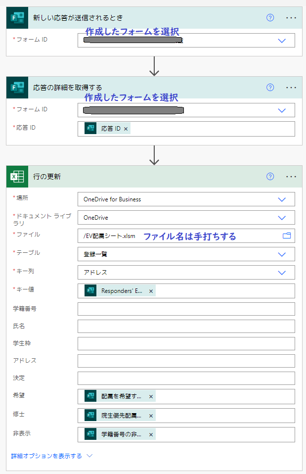
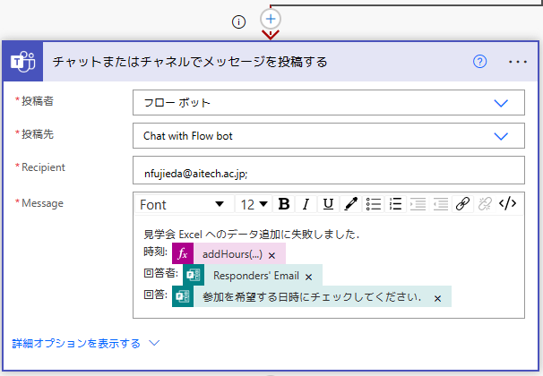

# リアルタイム回答状況更新可能なアンケートの作成
2023-01-31 ('lab-assign' Branch for Laboratory Assignment 2024-11-10)
Naoki FUJIEDA, AIT

## 概要
このリポジトリは，愛知工業大学が契約する Microsoft 365（AICoT）のサービスを使い，
リアルタイムに回答状況が更新できるアンケートを作成する方法と，そのための Excel
テンプレートを設置しています．

基本的には愛知工業大学の学内向けに最適化していますが，若干の改変を加えれば，
Microsoft 365 を採用している他の機関でも利用できるかもしれません．

このブランチは，愛知工業大学 電気学科における研究室配属調整の円滑化のために
カスタマイズされたバージョンとなります．

## 使用するツール
Microsoft 365 で，以下のサービスが契約範囲内にあることを前提とします．
- Forms
- Excel（基本的にオンライン版）
- Power Automate
- Teams（エラー通知する場合のみ）

## 動作するしくみ
1. Forms で学生がアンケートの回答を送信
2. 1をトリガーとして Power Automate のフローが起動して，回答を Excel のテーブル
   に記録
3. Excel 側でテーブルから各学生の最新回答を選別し，回答項目ごとにその回答をした
   学生の学籍番号を表示．ただし，学生が非表示を希望し，かつ院生優先配属枠を希望
   しない場合は*印でマスクする
4. 必要に応じ，Power Automate でエラーが発生した場合には，その旨を Teams で通知

## テンプレートの使用手順
### Forms でのアンケートの作成
まずは，Forms で新規にアンケートを作成します．

1. Forms で新規フォームを作成する
2. 1つ目の選択肢形式の質問を作成
   - タイトルは例えば「配属を希望する研究室を選択してください」などとする
   - 項目として研究室名を列挙
   - 複数回答をオフ，必須をオンに設定
3. 2つ目の選択肢形式の質問を作成
   - タイトルは例えば「院生優先配属枠への申込みを希望しますか」などとする
   - 必要に応じてサブタイトルで説明を加えても良い
   - 項目は「希望する」の1つのみ
   - 複数回答をオン，必須をオフに設定
4. 3つ目の選択肢形式の質問を作成
   - タイトルは例えば「学籍番号の非表示を希望しますか」などとする
   - 必要に応じてサブタイトルで説明を加えても良い
   - 項目は「希望する」の1つのみ
   - 複数回答をオン，必須をオフに設定
5. フォームの設定（「…」ボタンから）を開き，「自分の所属組織内のユーザーのみが
   回答可能」「名前を記録」にチェック
6. 「回答を収集」ボタンを押して，表示された回答ページへの URL を記録

### Forms での教員代理入力用アンケートの作成（オプション）
学生が Forms で回答している間に，欠席者等の分を教員が代理で入力したい場合には，
作成したアンケートを複製して，代理入力用のアンケートを作成しておきます．

1. Forms のフォーム一覧画面で，先ほど作成したフォームの右下の「…」をクリック
   して「コピー」を選択し，フォームを複製する
2. 複製後のフォームの編集画面に入る
3. 最初の質問の上に，テキスト形式の質問を挿入
  - タイトルは例えば「回答者の学籍番号」とする
  - 長い回答をオフ，必須をオンに設定

### Excel テンプレートの編集と公開
次に，回答状況を閲覧してもらうための Excel ファイルを編集・公開します．
以下の5まではオフラインで作業することを想定しています．
ただ，最初にアップロードして，全てオンライン版の Excel で作業しても構いません．

1. 付属の Excel テンプレートを開く
2. 「研究室」シートのテーブル A（研究室名と枠数）に，研究室名と枠数を記入する
   - 研究室名は，Forms の1つ目の質問の回答項目と一致させる
   - 抽選で配属者を決めると申し出があった研究室に対しては，優先度ランダムの列
     に何らかの値を入力する（そうでない場合は空のままにする）
3. 「研究室」シートのテーブル B に，配属対象者の学籍番号・氏名・GPA を入力する
4. 「研究室」シートのテーブル B に各研究室の列を作成する
   - テーブル A の研究室名の列の内容をコピーし，テーブル B の「A研」のセルを
     右クリック → 形式を選択して貼り付け → 行列を入れ替える
   - 優先度順に配属者を決めると申し出があった研究室に対しては，テーブル B の
     当該研究室の列に，学生ごとの優先度（高いほうが優先）を整数で入力する
5. 「回答」シートのテーブル C に，配属対象者の学籍番号・氏名・学生枠を入力する
   - 学生枠は A または B で入力する
6. 修正したテンプレートに適当な名前をつけて保存し，OneDrive にアップロード

必然的に学生の成績情報を含むことになりますので，アップロードしたファイルの共有
設定には十分気をつけてください．

### Power Automate でフローを作成
最後に，Power Automate で Forms と Excel を接続するフローを作成します．

1. Power Automate で「作成」→「自動化されたクラウド フロー」をクリック
    - フロー名は適当なわかりやすい名前
    - フローのトリガーは「新しい応答が送信されるとき Microsoft Forms」
2. 「新しい応答が送信されるとき」のフォーム ID をクリックし，先に作成した
   アンケートのタイトルを選択
3. 新しいステップで「応答の詳細を取得する Microsoft Forms」を選択
    - フォーム ID は先に作成したアンケートのタイトル
    - 応答 ID は「応答 ID」
4. 新しいステップで「行の更新 Excel Online (Business)」を選択
    - 場所は「OneDrive for Business」
    - ドキュメントライブラリは「OneDrive」
    - ファイル名は手打ちで入力する．例えば OneDrive の「自分のファイル」直下に
      「EV配属シート.xlsm」という名前で保存したなら，「/EV配属シート.xlsm」と
      入力する
    - テーブルは「登録一覧」（正しくファイル名が入力されていれば選択できるはず）
    - キー列は「アドレス」
    - キー値は「Responders' Email」（Forms のアイコン）
    - 希望は「配属を希望する……」（Forms の1つ目の質問タイトル）
    - 修士は「院生優先配属枠……」（Forms の2つ目の質問タイトル）
    - 非表示は「学籍番号の非表示……」（Forms の3つ目の質問タイトル）
    - その他の欄（学籍番号・氏名・学生枠・アドレス・決定）は空欄のまま

以上のステップを終えると，下図に示す通りのフローが表示されるはずです．

Forms で教員代理入力用アンケートを作成した場合は，以下の要領で代理入力用
アンケート用のフローも作成しておきます．

1. Power Automate で先ほど作成したフローの横の「︙」をクリックし，
   「名前をつけて保存」
2. 複製後のフローをクリックし，ツールバーの「オンにする」ボタンをクリックして
   から，「編集」ボタンをクリック
3. 「新しい応答が送信されるとき」「応答の詳細を取得する」のフォーム ID を
   クリックし，代理入力用アンケートを選択し直す
4. 「行の更新」のキー列を「学籍番号」に，キー値を「回答者の学籍番号」（Forms
   で挿入した質問のタイトル）に設定する

### エラー発生時にメッセージを投稿する（オプション）
何らかの理由により，Excel の行の更新が失敗する可能性があります．
その場合は Teams にメッセージを投稿するように設定できます．
必要に応じて設定してください．

1. 作成したフローに新しいステップを追加
   - 種類は「チャットまたはチャネルでメッセージを投稿する Microsoft Teams」
2. 「…」ボタンから「実行条件の構成」を選択
   - 「に成功しました」のチェックをオフにする
   - それ以外のチェックをオンにする
   - 「完了」ボタンを押す
3. ステップの設定を行う
   - 投稿者は「フローボット」
   - 投稿先は「Chat with Flow bot」
   - Recipient には AICoT の ID（nd??????@aitech.ac.jp）を入力
   - Message 欄には投稿したいメッセージを入力
   - 必要に応じて回答者のメールアドレス（Responders' Email）をメッセージに含めて
     おくと，問題解決に役立つかもしれません

以上のステップを終えると，下図に示す通りのフローが追加されるはずです．
失敗時に発動するように設定しているため，矢印は赤の点線で表示されます．

## 配属調整当日のワークフロー

投影用と作業用で，2台PCを用意しておくと便利です．
投影用PCは，OneDrive にアップロードした Excel ファイルがブラウザで表示できる
ようになっていれば，自分のものでなくても構いません．

1. 調整会の前に，研究室の配属枠数と優先度を再確認しておく
  - 抽選で配属者を決める研究室は，テーブル A の優先度ランダムの列に何か記入
  - あらかじめ優先度を決める研究室は，テーブル B の当該研究室の列に優先度を記入
2. 投影用PCのブラウザで，OneDrive にアップした Excel ファイルの「一覧表示用」
   シートを表示し，その画面を学生が集合した部屋のプロジェクタで投影しておく
3. 作業用PCのブラウザで，Forms のアンケートと OneDrive をそれぞれ開いておく
   （これ以降は，作業用PCを使って作業する）
4. フォームの設定（「…」ボタンから）を開き，「回答を受け付ける」をチェックし，
   学生の配属希望の受付を始める
5. 教員代理入力用アンケートを作成した場合は，必要に応じて代理入力を行う
6. 十分な時間が経過したら，「回答を受け付ける」のチェックを外して，学生の配属
   希望の受付を〆切る
7. Excel ファイルの更新がなくなったことを確認したら，OneDrive で Excel ファイル
   をダウンロードする
8. ダウンロードしたファイルを PC 版の Excel で開き，「調整用マクロ」のシートを
   使って，各研究室の配属者を決定する
9. すべての研究室の調整が終わったら，「調整用マクロ」の「次ラウンドへ」ボタン
   を押して，配属未決定者の希望を取り消す
10. 調整後の Excel ファイルを保存し，OneDrive に上書きアップロードする
    - 7～10 の間の時間が6分以内だと，アップロードに失敗する可能性がある．
      その場合はテーブル C の内容をまるごとコピーペーストで対応する
11. 未調整の研究室が残り1つになるまで，4～10 のステップを繰り返す

## ライセンス

New BSD ライセンスが適用されます．詳細は COPYING ファイルを参照してください．

Copyright (C) 2023-2024 Naoki FUJIEDA. All rights reserved.